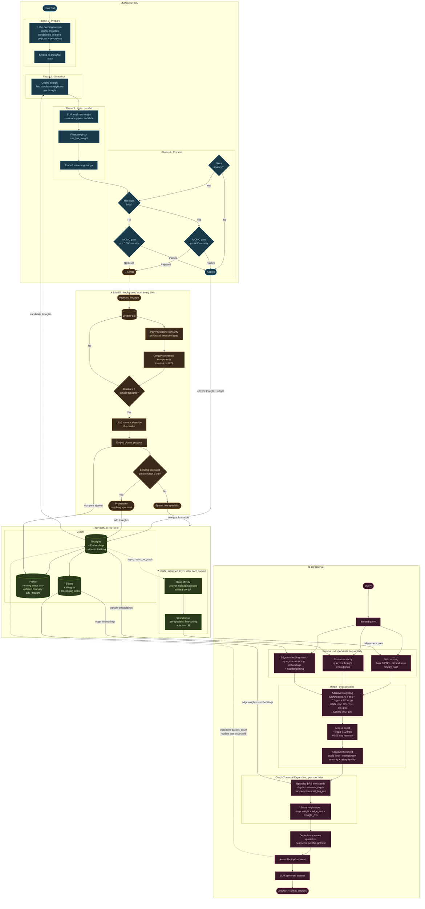

# Knod — Process Flow

```mermaid
flowchart TB

    %% ═══════════════════════════════════════════════════════════
    %% INGESTION
    %% Input:  Raw text + optional source/descriptor
    %% Output: Committed thoughts → Specialist Store
    %% ═══════════════════════════════════════════════════════════
    subgraph INGEST ["📥 INGESTION"]
        direction TB

        IN_A([Raw Text]):::ingest

        subgraph INGEST_PREPARE ["Phase 1 · Prepare"]
            direction TB
            I_DEC["LLM: decompose into atomic thoughts\nconditioned on store purpose + descriptors"]:::ingest
            I_EMB[Embed all thoughts\nbatch]:::ingest
            I_DEC --> I_EMB
        end

        subgraph INGEST_SNAPSHOT ["Phase 2 · Snapshot"]
            direction TB
            I_SNA[Cosine search:\nfind candidate neighbors\nper thought]:::ingest
        end

        subgraph INGEST_LINK ["Phase 3 · Link  ·  parallel"]
            direction TB
            I_LNK[LLM: evaluate weight\n+ reasoning per candidate]:::ingest
            I_FLT[Filter: weight ≥ min_link_weight]:::ingest
            I_EMR[Embed reasoning strings]:::ingest
            I_LNK --> I_FLT --> I_EMR
        end

        subgraph INGEST_COMMIT ["Phase 4 · Commit"]
            direction TB
            I_MAT{Store\nmature?}:::ingest
            I_HAS{Has valid\nlinks?}:::ingest
            I_MCC_L{MCMC gate\np = 0.5^maturity}:::ingest
            I_MCC_U{MCMC gate\np = 0.05^maturity}:::ingest
            I_ACC([Accept]):::ingest
            I_MAT -- No  --> I_ACC
            I_MAT -- Yes --> I_HAS
            I_HAS -- Yes --> I_MCC_L
            I_HAS -- No  --> I_MCC_U
            I_MCC_L -- Passes  --> I_ACC
            I_MCC_L -- Rejected --> I_LBO([→ Limbo]):::limbo
            I_MCC_U -- Passes  --> I_ACC
            I_MCC_U -- Rejected --> I_LBO
        end

        IN_A --> I_DEC
        I_EMB --> I_SNA
        I_SNA --> I_LNK
        I_EMR --> I_HAS
    end

    %% ═══════════════════════════════════════════════════════════
    %% LIMBO
    %% Input:  Rejected thoughts (no links + mature store)
    %% Output: Promoted thoughts → existing or new Specialist
    %% ═══════════════════════════════════════════════════════════
    subgraph LIMBO_SG ["🌀 LIMBO  ·  background scan every 60 s"]
        direction TB

        LB_IN([Rejected Thought]):::limbo
        LB_POOL[(Limbo Pool)]:::limbo
        LB_SIM[Pairwise cosine similarity\nacross all limbo thoughts]:::limbo
        LB_CC[Greedy connected components\nthreshold = 0.75]:::limbo
        LB_CLU{Cluster ≥ 3\nsimilar thoughts?}:::limbo
        LB_NM[LLM: name + describe\nthe cluster]:::limbo
        LB_EP[Embed cluster purpose]:::limbo
        LB_MAT{Existing specialist\nprofile match ≥ 0.8?}:::limbo
        LB_PRO([Promote to\nmatching specialist]):::limbo
        LB_NEW([Spawn new specialist]):::limbo

        LB_IN   --> LB_POOL
        LB_POOL --> LB_SIM
        LB_SIM  --> LB_CC
        LB_CC   --> LB_CLU
        LB_CLU -- No  --> LB_POOL
        LB_CLU -- Yes --> LB_NM
        LB_NM   --> LB_EP
        LB_EP   --> LB_MAT
        LB_MAT -- Yes --> LB_PRO
        LB_MAT -- No  --> LB_NEW
    end

    %% ═══════════════════════════════════════════════════════════
    %% SPECIALIST STORE
    %% Input:  Committed thoughts, GNN training signal
    %% Output: Graph + trained model ready for retrieval
    %% ═══════════════════════════════════════════════════════════
    subgraph SPECIALIST ["🧠 SPECIALIST STORE"]
        direction TB

        subgraph SP_GRAPH ["Graph"]
            direction LR
            SP_T[(Thoughts\n+ Embeddings\n+ Access tracking)]:::store
            SP_E[(Edges\n+ Weights\n+ Reasoning embs)]:::store
            SP_P[(Profile\nrunning mean emb\nupdated on every add_thought)]:::store
            SP_T --> SP_E
            SP_T --> SP_P
        end

        subgraph SP_GNN ["GNN  ·  retrained async after each commit"]
            direction TB
            SP_BASE[Base MPNN\n3-layer message passing\nshared low LR]:::store
            SP_STR[StrandLayer\nper-specialist fine-tuning\nadaptive LR]:::store
            SP_BASE --> SP_STR
        end

        SP_GRAPH --> SP_GNN
    end

    %% ═══════════════════════════════════════════════════════════
    %% RETRIEVAL
    %% Input:  Query string
    %% Output: Answer + ranked source thoughts
    %% ═══════════════════════════════════════════════════════════
    subgraph QUERY ["🔍 RETRIEVAL"]
        direction TB

        Q_IN([Query]):::retrieval
        Q_EMB[Embed query]:::retrieval

        subgraph Q_FANOUT ["Fan-out · all specialists sequentially"]
            direction LR
            Q_S1[GNN scoring\nbase MPNN + StrandLayer\nforward pass]:::retrieval
            Q_S2[Cosine similarity\nquery vs thought embeddings]:::retrieval
            Q_S3[Edge embedding search\nquery vs reasoning embeddings\n× 0.8 dampening]:::retrieval
        end

        subgraph Q_MERGE ["Merge · per specialist"]
            direction TB
            Q_WGT[Adaptive weighting\nGNN+edges: 0.4·cos + 0.4·gnn + 0.2·edge\nGNN only:  0.5·cos + 0.5·gnn\nCosine only: cos]:::retrieval
            Q_BST[Access boost\n+log1p·0.02 freq\n+0.05·exp recency]:::retrieval
            Q_THR[Adaptive threshold\nscale floor→cfg between maturity × query-quality]:::retrieval
            Q_WGT --> Q_BST --> Q_THR
        end

        subgraph Q_EXP ["Graph Traversal Expansion · per specialist"]
            direction TB
            Q_EXP_BFS[Bounded BFS from seeds\ndepth ≤ traversal_depth\nfan-out ≤ traversal_fan_out]:::retrieval
            Q_EXP_SCR[Score neighbours:\nedge.weight × edge_cos × thought_cos]:::retrieval
            Q_EXP_BFS --> Q_EXP_SCR
        end

        Q_DED[Deduplicate across specialists\nbest score per thought text]:::retrieval

        Q_CTX[Assemble top-k context]:::retrieval
        Q_LLM[LLM: generate answer]:::retrieval
        Q_OUT([Answer + ranked sources]):::retrieval

        Q_IN  --> Q_EMB
        Q_EMB --> Q_S1 & Q_S2 & Q_S3
        Q_S1 & Q_S2 & Q_S3 --> Q_WGT
        Q_THR --> Q_EXP_BFS
        Q_EXP_SCR --> Q_DED
        Q_DED --> Q_CTX --> Q_LLM --> Q_OUT
    end

    %% ═══════════════════════════════════════════════════════════
    %% CROSS-SUBGRAPH WIRING
    %% ═══════════════════════════════════════════════════════════

    %% Store → Ingest snapshot (Phase 2 reads live graph)
    SP_T        -->|"candidate thoughts"| I_SNA

    %% Ingest → Store
    I_ACC       -->|"commit thought + edges"| SP_T

    %% Ingest rejects → Limbo
    I_LBO       --> LB_IN

    %% Store update triggers async GNN retrain
    SP_T        -.->|"async: train_on_graph"| SP_BASE

    %% Limbo: profile comparison uses SP_P
    LB_EP       -->|"compare against"| SP_P

    %% Limbo promotions → Store
    LB_PRO      -->|"add thoughts"| SP_T
    LB_NEW      -->|"new graph + model"| SPECIALIST

    %% Store feeds retrieval
    SP_T        -->|"thought embeddings"| Q_S2
    SP_E        -->|"edge embeddings"| Q_S3
    SP_STR      -->|"relevance scores"| Q_S1

    %% Access tracking feedback (happens during context assembly, after dedup)
    Q_CTX       -.->|"increment access_count\nupdate last_accessed"| SP_T

    %% Traversal expansion uses graph edges
    SP_E        -->|"edge weights + embeddings"| Q_EXP_BFS

    %% ═══════════════════════════════════════════════════════════
    %% STYLES
    %% ═══════════════════════════════════════════════════════════
    classDef ingest    fill:#1a3a4a,stroke:#4a9bbe,color:#cce8f4
    classDef retrieval fill:#3a1a2a,stroke:#be4a7a,color:#f4cce0
    classDef store     fill:#2a3a1a,stroke:#7abe4a,color:#e0f4cc
    classDef limbo     fill:#3a2a1a,stroke:#be8a4a,color:#f4e0cc
```
