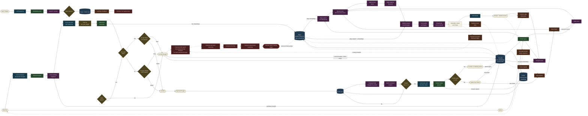

# Knod — Process Flow

```mermaid
flowchart LR

    %% ═══════════════════════════════════════════════════════════
    %% LEGEND
    %% One integrated graph. Colors indicate node job, not section.
    %% ═══════════════════════════════════════════════════════════
    L_IO([Input / Output]):::io
    L_LLM[LLM reasoning]:::llm
    L_EMB[Embedding work]:::embed
    L_SCR[Search / scoring]:::score
    L_GAT{Gate / decision}:::gate
    L_STO[(Graph / model state)]:::store
    L_LRN[Learning / feedback]:::learn
    L_PLN[Planned / not implemented]:::planned

    L_IO --- L_LLM --- L_EMB --- L_SCR --- L_GAT --- L_STO --- L_LRN --- L_PLN

    %% Main flow nodes
    IN_A([Raw text]):::io
    Q_IN([Query]):::io

    I_DEC[LLM decompose\ninto atomic thoughts]:::llm
    I_EMB[Embed thoughts]:::embed
    I_SNA[Find candidate\nneighbors]:::score
    I_LNK[LLM score links\nand reasoning]:::llm
    I_FLT[Filter by\nmin_link_weight]:::gate
    I_EMR[Embed link\nreasoning]:::embed

    I_MAT{Store\nmature?}:::gate
    I_HAS{Any valid\nlinks?}:::gate
    I_MCC_L{Accept linked\n0.5^maturity}:::gate
    I_MCC_U{Accept unlinked\n0.05^maturity}:::gate
    I_ACC([Commit thought]):::io
    I_LBO([To limbo]):::io

    I_RSN[Planned relink search\nfind unlinked similar thoughts\nfor each committed thought]:::planned
    I_RLK[Planned LLM relink reasoning]:::planned
    I_RFL[Planned relink filter]:::planned
    I_RER[Planned embed relink reasoning]:::planned
    I_RAP([Planned attach missing edges]):::planned

    LB_IN([Rejected thought]):::io
    LB_POOL[(Limbo pool)]:::store
    LB_SIM[Compare limbo\nthoughts by cosine]:::score
    LB_CC[Build connected\nclusters]:::score
    LB_CLU{Cluster\nsize >= 3?}:::gate
    LB_NM[LLM name and\ndescribe cluster]:::llm
    LB_EP[Embed cluster\npurpose]:::embed
    LB_MAT{Profile match\n>= 0.8?}:::gate
    LB_PRO([Promote to matching strand]):::io
    LB_NEW([Spawn new strand]):::io

    SP_T[(Thoughts\ntext embeddings\naccess stats)]:::store
    SP_E[(Edges\nweights reasoning\nedge embeddings)]:::store
    SP_P[(Profile\nrunning mean\nembedding)]:::store
    SP_BASE[Base MPNN]:::learn
    SP_STR[Strand layer]:::learn

    Q_EMB[Embed query]:::embed
    Q_S1[GNN score]:::score
    Q_S2[Thought cosine]:::score
    Q_S3[Edge search\n0.8 dampening]:::score
    Q_WGT[Blend scores\nand keep max cosine]:::score
    Q_BST[Apply access\nboost]:::score
    Q_THR[Apply adaptive\nthreshold]:::score
    Q_EXP[Dijkstra expand\ntoward targets]:::score
    Q_PATH[Score paths\nand targets]:::score
    Q_DED[Deduplicate\nacross strands]:::score
    Q_CTX[Assemble context\nand chains]:::io
    Q_LLM[LLM answer]:::llm
    Q_OUT([Answer + ranked sources]):::io

    F_TRAIN[Train on graph]:::learn
    F_ACCESS[Update access\nstats]:::learn
    F_SUCCESS[Reward successful\ntraversed edges]:::learn
    F_REFINE[Periodic edge\nrefinement]:::learn
    F_FLY[Re-ingest answer\nquery_response]:::learn

    %% ═══════════════════════════════════════════════════════════
    %% CROSS-FLOW WIRING
    %% ═══════════════════════════════════════════════════════════

    %% Ingestion flow
    IN_A --> I_DEC --> I_EMB --> I_SNA --> I_LNK --> I_FLT --> I_EMR --> I_HAS
    I_MAT -- No --> I_ACC
    I_MAT -- Yes --> I_HAS
    I_HAS -- Yes --> I_MCC_L
    I_HAS -- No --> I_MCC_U
    I_MCC_L -- Pass --> I_ACC
    I_MCC_L -- Reject --> I_LBO
    I_MCC_U -- Pass --> I_ACC
    I_MCC_U -- Reject --> I_LBO
    I_ACC -.-> I_RSN -.-> I_RLK -.-> I_RFL -.-> I_RER -.-> I_RAP

    %% Limbo flow
    LB_IN --> LB_POOL --> LB_SIM --> LB_CC --> LB_CLU
    LB_CLU -- No --> LB_POOL
    LB_CLU -- Yes --> LB_NM --> LB_EP --> LB_MAT
    LB_MAT -- Yes --> LB_PRO
    LB_MAT -- No --> LB_NEW

    %% Store supports ingest snapshot and relink
    SP_T -->|candidate thoughts| I_SNA
    SP_T -.->|existing thoughts| I_RSN

    %% Commit writes into the graph
    I_ACC -->|commit thought + initial edges| SP_T
    I_EMR -->|link embeddings| SP_E
    I_RAP -.->|planned missing edges| SP_E
    I_LBO --> LB_IN

    %% Limbo promotion writes back into the graph system
    LB_PRO -->|add thoughts| SP_T
    LB_NEW -->|new graph| SP_T
    LB_NEW -->|new model| SP_BASE
    LB_EP -->|compare against| SP_P

    %% Store and model structure
    SP_T --> SP_E
    SP_T --> SP_P
    SP_BASE --> SP_STR

    %% Retrieval flow
    Q_IN --> Q_EMB
    Q_EMB --> Q_S1
    Q_EMB --> Q_S2
    Q_EMB --> Q_S3
    Q_S1 --> Q_WGT
    Q_S2 --> Q_WGT
    Q_S3 --> Q_WGT
    Q_WGT --> Q_BST --> Q_THR --> Q_EXP --> Q_PATH --> Q_DED --> Q_CTX --> Q_LLM --> Q_OUT

    %% Layout nudges for left-to-right reading
    IN_A --- Q_IN
    I_ACC --- SP_T
    SP_T --- Q_EMB
    LB_POOL --- SP_P
    SP_STR --- Q_WGT
    Q_OUT --- F_REFINE

    %% Store feeds retrieval
    SP_T -->|thought embeddings| Q_S2
    SP_E -->|edge embeddings| Q_S3
    SP_E -->|edge weights + embeddings| Q_EXP
    SP_STR -->|relevance scores| Q_S1

    %% Learning loop in place
    SP_T -.-> F_TRAIN -.-> SP_BASE
    Q_CTX -.-> F_ACCESS -.-> SP_T
    Q_CTX -.-> F_SUCCESS -.-> SP_E
    Q_OUT -.-> F_REFINE -.-> SP_E
    Q_OUT -.-> F_FLY -.-> IN_A

    %% ═══════════════════════════════════════════════════════════
    %% STYLES
    %% ═══════════════════════════════════════════════════════════
    classDef io      fill:#f2efe3,stroke:#9a8f5a,color:#2f2a16
    classDef llm     fill:#183a48,stroke:#5fb0d3,color:#d9f3ff
    classDef embed   fill:#24452a,stroke:#77c587,color:#e4ffe8
    classDef score   fill:#442042,stroke:#d48ad1,color:#ffe5fe
    classDef gate    fill:#4c421f,stroke:#d5b35c,color:#fff4cf
    classDef store   fill:#21374b,stroke:#7bafe3,color:#dfefff
    classDef learn   fill:#4a2c1f,stroke:#ff9a6a,color:#ffe8dc
    classDef planned fill:#4a1f1f,stroke:#ff6b6b,color:#ffd7d7
```
